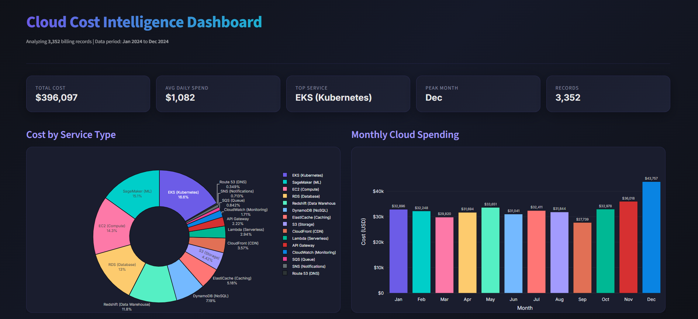
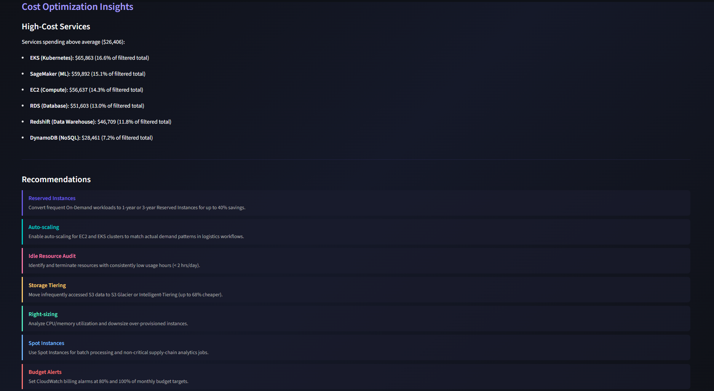

<div align="center">

# ☁️ Cloud Cost Intelligence Platform for Supply Chain

[](https://python.org)
[](https://streamlit.io)
[](https://pandas.pydata.org)
[](https://plotly.com/python/)
[](https://opensource.org/licenses/MIT)

[](https://cloud-cost-intelligence-aswinn47.streamlit.app)


**A beginner-friendly, industry-standard project for analyzing and visualizing cloud billing data in a supply-chain context.**

[Report Bug](https://github.com/aswinn47/Cloud-Cost-Intelligence/issues) · [Request Feature](https://github.com/aswinn47/Cloud-Cost-Intelligence/issues)

</div>

---

## 📖 Table of Contents

- [About the Project](#-about-the-project)
- [Key Features](#-key-features)
- [Tech Stack](#-tech-stack)
- [Project Structure](#-project-structure)
- [Getting Started](#-getting-started)
  - [Prerequisites](#prerequisites)
  - [Installation](#installation)
- [Usage](#-usage)
- [Dataset Dictionary](#-dataset-dictionary)
- [Screenshots](#-screenshots)
- [Contributing](#-contributing)
- [License](#-license)

---

## 🚀 About The Project

Cloud services (AWS, Azure, GCP) generate massive amounts of daily billing records. Without proper oversight, it's easy for cloud costs to spiral out of control. 

This platform **loads**, **cleans**, **analyzes**, and **visualizes** synthetic billing data so DevOps, Engineering, and Finance teams can:
- **Spot** which services burn the most budget.
- **Detect** unusual cost spikes before they snowball.
- **Find** optimization opportunities (Reserved Instances, right-sizing).
- **Track** spending trends across regions, departments, and months.

<details>
<summary><strong>💡 Why this project? (Click to expand)</strong></summary>
Understanding cloud cost is a critical skill for modern DevOps and Data professionals. This project bridges the gap between raw data and actionable business insights by simulating real-world scenarios in a supply-chain environment.
</details>

---

## ✨ Key Features

- 🛠️ **Synthetic Data Generation**: Creates highly realistic cloud billing datasets with anomalies and trends.
- 🧹 **Automated Data Cleaning**: Handles missing values, duplicates, and type conversions seamlessly.
- 📊 **Exploratory Data Analysis (EDA)**: Out-of-the-box analytical scripts identifying top cost drivers.
- 📈 **Interactive Streamlit Dashboard**: A beautiful, real-time filtering interface to explore cost data visually.
- 💡 **Cost Optimization Insights**: Automatically detects potential savings via Reserved Instances and flags daily anomalies.
- 📑 **Comprehensive Reporting**: Exports cleaned data, summary statistics, and multi-sheet Excel workbooks.

---

## 💻 Tech Stack

<div align="center">
  
  
  
  
  
</div>

---

## 📂 Project Structure

```bash
Cloud-Cost-Intelligence/
├── 📁 assets/                # Screenshots and images for documentation
├── 📁 data/                  # Raw and processed billing data 
├── 📁 notebooks/             # Data analysis scripts (analysis.py)
├── 📁 dashboard/             # Streamlit application files (app.py)
├── 📁 outputs/               # Auto-generated PNG charts and graphs
├── 📁 reports/               # Auto-generated CSV / Excel summaries
├── 📄 generate_data.py       # Script to generate synthetic billing data
├── 📄 requirements.txt       # Project dependencies
└── 📄 README.md              # Project documentation
```

---

## 🏁 Getting Started

Follow these steps to get a local copy up and running.

### Prerequisites

Ensure you have Python 3.10 or higher installed. You can download it from [python.org](https://python.org).

### Installation

1. **Clone the repository** (if applicable):
   ```bash
   git clone https://github.com/your-username/Cloud-Cost-Intelligence.git
   cd Cloud-Cost-Intelligence
   ```

2. **Create a virtual environment** (recommended):
   ```bash
   python -m venv venv
   source venv/bin/activate  # On Windows use `venv\Scripts\activate`
   ```

3. **Install dependencies**:
   ```bash
   pip install -r requirements.txt
   ```

---

## 🎯 Usage

### 1. Generate Sample Data
Run the synthetic data generator to create a realistic 2024 billing dataset:
```bash
python generate_data.py
```
> **Note:** This creates `data/cloud_billing_2024.csv` with roughly 3,300 records.

### 2. Run the Analysis
Execute the analytical pipeline to clean data and generate static reports:
```bash
python notebooks/analysis.py
```
> **Output:** Finds anomalies, generates charts in `outputs/charts/`, and exports reports to `reports/`.

### 3. Launch the Live Dashboard
Spin up the interactive Streamlit app to explore your data:
```bash
streamlit run dashboard/app.py
```
Your browser will automatically open to `http://localhost:8501`. 

---

## 🗂 Dataset Dictionary

| Column | Description | Data Type |
| :--- | :--- | :--- |
| `Date` | Billing date (YYYY-MM-DD) | `Datetime` |
| `Service_Type` | Cloud service name (e.g., EC2, S3, RDS) | `String` |
| `Region` | AWS region code (e.g., us-east-1, eu-west-1) | `String` |
| `Cost_USD` | Daily cost in US dollars | `Float` |
| `Cost_Category` | Pricing model (On-Demand, Reserved, Spot) | `String` |
| `Department` | Team that owns the resource (e.g., Logistics, Analytics) | `String` |
| `Usage_Hours` | Hours the resource was active during the day | `Float` |
| `Resource_Tags` | Auto-generated tag for resource identification | `String` |

---

## 📸 Screenshots


<details open>
<summary><strong>Dashboard Overview</strong></summary>

> 
> *Interactive filters and high-level KPIs*

</details>

<details>
<summary><strong>Cost Optimization & Anomalies</strong></summary>

> 
> *Identifying top cost drivers and detecting unusual spending spikes*

</details>

---

## 🤝 Contributing

Contributions are what make the open-source community such an amazing place to learn, inspire, and create. Any contributions you make are **greatly appreciated**.

1. Fork the Project
2. Create your Feature Branch (`git checkout -b feature/AmazingFeature`)
3. Commit your Changes (`git commit -m 'Add some AmazingFeature'`)
4. Push to the Branch (`git push origin feature/AmazingFeature`)
5. Open a Pull Request

---

## 📜 License

Distributed under the MIT License. See `LICENSE` for more information.

---

