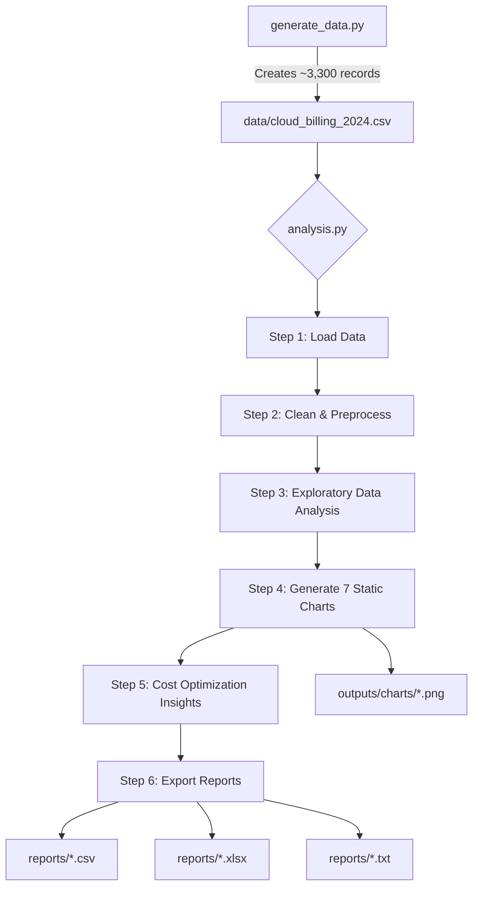
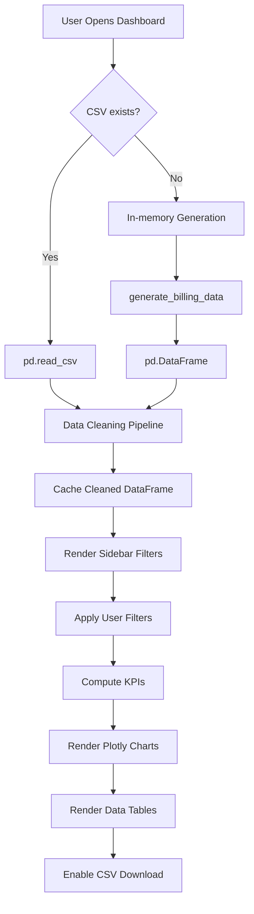

# High-Level Design (HLD)
# Cloud Cost Intelligence Platform for Supply Chain

| Field            | Value                                          |
|------------------|------------------------------------------------|
| **Document**     | High-Level Design (HLD)                        |
| **Project**      | Cloud Cost Intelligence Platform               |
| **Version**      | 1.0                                            |
| **Date**         | April 2026                                     |
| **Status**       | Final                                          |

---

## Table of Contents

1. [Introduction](#1-introduction)
2. [System Design](#2-system-design)
3. [Data Design](#3-data-design)
4. [Interfaces](#4-interfaces)
5. [State and Session Management](#5-state-and-session-management)
6. [Caching](#6-caching)
7. [Non-Functional Requirements](#7-non-functional-requirements)
8. [References](#8-references)

---

## 1. Introduction

The **Cloud Cost Intelligence Platform** is a Python-based analytics solution that enables supply-chain organizations to monitor, analyze, and optimize their multi-cloud spending. It ingests daily billing records, applies automated data cleaning, performs exploratory analysis, detects cost anomalies, and presents interactive dashboards for data-driven FinOps decisions.

### 1.1 Scope of the Document

This High-Level Design document covers:

- End-to-end system architecture of the Cloud Cost Intelligence Platform.
- Application design, process flows, and component responsibilities.
- Data model, access patterns, retention, and migration strategies.
- Interface contracts between internal modules and external systems.
- Caching, session management, and non-functional requirements (security, performance).

**Out of Scope:** Low-level implementation details (class diagrams, function signatures), CI/CD pipeline configuration, and infrastructure-as-code templates.

### 1.2 Intended Audience

| Audience                  | Purpose                                              |
|---------------------------|------------------------------------------------------|
| Solution Architects       | Validate architecture patterns and scalability       |
| Development Team          | Understand component boundaries and data flow        |
| DevOps / Platform Eng.    | Plan deployment, caching, and infrastructure         |
| QA / Testing Team         | Design integration and performance test strategies   |
| Product / Business Owners | Review functional coverage and optimization features |
| FinOps Stakeholders       | Understand cost visibility and reporting capabilities|

### 1.3 System Overview

The platform consists of four major subsystems:

```
┌─────────────────────────────────────────────────────────────────┐
│                  Cloud Cost Intelligence Platform               │
├──────────────┬──────────────┬───────────────┬───────────────────┤
│  Data        │  Analysis    │  Dashboard    │  Reporting        │
│  Generation  │  Engine      │  (Streamlit)  │  Engine           │
│  Layer       │              │               │                   │
├──────────────┼──────────────┼───────────────┼───────────────────┤
│ Synthetic    │ Cleaning &   │ Interactive   │ CSV / Excel /     │
│ billing data │ EDA pipeline │ Plotly charts │ Text exports      │
│ generator    │ + anomaly    │ + KPI cards   │ + optimization    │
│              │ detection    │ + filters     │ reports           │
└──────────────┴──────────────┴───────────────┴───────────────────┘
```

**Key Capabilities:**
- Synthetic data generation simulating 15 AWS services across 5 regions and 6 supply-chain departments.
- Automated data cleaning (deduplication, missing value imputation, type coercion).
- 7 publication-quality static charts and 6 interactive Plotly visualizations.
- Real-time sidebar filtering by Date, Month, Service, Region, and Department.
- Cost anomaly detection using statistical thresholds (mean + 2σ).
- Actionable optimization recommendations (Reserved Instances, right-sizing, Spot, storage tiering).
- Multi-format export: CSV, multi-sheet Excel workbook, and text reports.

---

## 2. System Design

### 2.1 Application Design

The platform follows a **layered monolithic architecture** with clear separation of concerns:

```
┌─────────────────────────────────────────────────────┐
│                 PRESENTATION LAYER                  │
│         Streamlit Dashboard (dashboard/app.py)      │
│   ┌──────────┬──────────┬──────────┬──────────┐     │
│   │ Sidebar  │   KPI    │  Plotly  │  Data    │     │
│   │ Filters  │  Cards   │  Charts  │  Tables  │     │
│   └──────────┴──────────┴──────────┴──────────┘     │
├─────────────────────────────────────────────────────┤
│                 BUSINESS LOGIC LAYER                │
│          Analysis Engine (notebooks/analysis.py)    │
│   ┌──────────┬──────────┬──────────┬──────────┐     │
│   │  Data    │   EDA    │ Anomaly  │  Cost    │     │
│   │ Cleaning │ Pipeline │ Detect.  │ Optimize │     │
│   └──────────┴──────────┴──────────┴──────────┘     │
├─────────────────────────────────────────────────────┤
│                    DATA LAYER                       │
│        Data Generator (generate_data.py)            │
│   ┌──────────┬──────────┬──────────┐                │
│   │ Synth.   │   CSV    │  Report  │                │
│   │ Engine   │  Store   │  Export  │                │
│   └──────────┴──────────┴──────────┘                │
└─────────────────────────────────────────────────────┘
```

**Technology Stack:**

| Layer          | Technology                     | Purpose                          |
|----------------|--------------------------------|----------------------------------|
| Presentation   | Streamlit 1.28+, Plotly 5.18+  | Interactive web dashboard        |
| Business Logic | Pandas 1.5+, NumPy, Matplotlib | Data processing & static charts  |
| Data Storage   | CSV flat files                 | Lightweight, portable storage    |
| Export         | openpyxl 3.1+                  | Multi-sheet Excel workbooks      |
| Deployment     | Streamlit Community Cloud      | Free hosting with GitHub CI      |

### 2.2 Process Flow

#### 2.2.1 Data Pipeline Flow



#### 2.2.2 Dashboard Runtime Flow



### 2.3 Information Flow

```
┌──────────────┐    CSV     ┌──────────────┐   Pandas DF   ┌──────────────┐
│   Data       │ ────────>  │   Analysis   │ ───────────>  │  Dashboard   │
│   Generator  │            │   Engine     │               │  (Streamlit) │
└──────────────┘            └──────┬───────┘               └──────────────┘
                                   │
                          ┌────────┴────────┐
                          ▼                 ▼
                   ┌──────────┐      ┌──────────┐
                   │  Charts  │      │  Reports │
                   │  (PNG)   │      │ CSV/XLSX │
                   └──────────┘      └──────────┘
```

| Flow Path                  | Data Format      | Protocol    |
|----------------------------|------------------|-------------|
| Generator → CSV File       | CSV (UTF-8)      | File I/O    |
| CSV File → Analysis Engine | Pandas DataFrame | File I/O    |
| CSV File → Dashboard       | Pandas DataFrame | File I/O    |
| Dashboard → Browser        | HTML/JS/JSON     | HTTP (8501) |
| Analysis → Charts          | PNG images       | File I/O    |
| Analysis → Reports         | CSV / XLSX / TXT | File I/O    |
| User → Dashboard           | HTTP requests    | WebSocket   |

### 2.4 Components Design

#### Component 1: Synthetic Data Generator (`generate_data.py`)

| Attribute      | Detail                                                    |
|----------------|-----------------------------------------------------------|
| **Purpose**    | Generate realistic cloud billing records for 2024         |
| **Input**      | Configuration constants (services, regions, cost ranges)  |
| **Output**     | `data/cloud_billing_2024.csv` (~3,300 records)            |
| **Key Logic**  | Seasonal spikes (Nov-Dec), 3% anomaly injection, intentional data quality issues (15 duplicates, 20 missing values) |

#### Component 2: Analysis Engine (`notebooks/analysis.py`)

| Attribute      | Detail                                                    |
|----------------|-----------------------------------------------------------|
| **Purpose**    | End-to-end offline analysis pipeline                      |
| **Input**      | `data/cloud_billing_2024.csv`                             |
| **Output**     | 7 PNG charts, 4 CSV summaries, 1 Excel workbook, 1 optimization report |
| **Pipeline**   | Load → Clean → EDA → Visualize → Optimize → Export       |

#### Component 3: Interactive Dashboard (`dashboard/app.py`)

| Attribute      | Detail                                                    |
|----------------|-----------------------------------------------------------|
| **Purpose**    | Real-time interactive cost exploration                    |
| **Input**      | CSV file or in-memory generated data                     |
| **Output**     | Web UI at `localhost:8501`                                |
| **UI Sections**| Sidebar Filters, 5 KPI Cards, 6 Plotly Charts, Top Services Table, Filtered Data Table, Optimization Insights Tab |

#### Component 4: Reporting Engine (embedded in analysis.py)

| Attribute      | Detail                                                    |
|----------------|-----------------------------------------------------------|
| **Purpose**    | Generate exportable business reports                     |
| **Outputs**    | `cleaned_billing_data.csv`, `summary_by_service.csv`, `summary_by_month.csv`, `summary_by_region.csv`, `optimization_report.txt`, `cloud_cost_report.xlsx` |

### 2.5 Key Design Considerations

| Consideration          | Decision                                     | Rationale                                   |
|------------------------|----------------------------------------------|---------------------------------------------|
| **Data Storage**       | CSV flat files                               | Zero infrastructure, Git-friendly, portable |
| **In-Memory Fallback** | Generate data via Python when CSV unavailable| Streamlit Cloud has read-only filesystem     |
| **Visualization Dual** | Matplotlib (static) + Plotly (interactive)   | Static for reports, interactive for dashboard|
| **Cleaning Strategy**  | Mode for categorical, median for numerical   | Robust against outliers                     |
| **Anomaly Detection**  | Statistical threshold (mean + 2σ)            | Simple, interpretable, no ML dependency     |
| **Deployment**         | Streamlit Community Cloud                    | Free, GitHub-integrated, zero DevOps        |
| **Styling**            | Custom CSS with CSS variables                | Consistent dark theme across all components |

### 2.6 API Catalogue

> **Note:** This is a monolithic application without REST APIs. The internal function interfaces serve as the API contracts.

| Function                     | Module            | Parameters                                        | Returns             |
|------------------------------|-------------------|---------------------------------------------------|---------------------|
| `generate_billing_data()`    | `generate_data`   | `start_date`, `end_date`, `records_per_day`       | `list[dict]`        |
| `save_csv()`                 | `generate_data`   | `rows: list[dict]`, `path: str`                   | `None` (writes file)|
| `load_data()`                | `dashboard/app`   | None (reads from `DATA_PATH` or generates)        | `pd.DataFrame`      |

**Dashboard Filter Interface (Streamlit Widgets):**

| Filter          | Widget Type    | Key            | Default      |
|-----------------|----------------|----------------|--------------|
| Date Range      | `date_input`   | `date_range`   | Full range   |
| Month           | `multiselect`  | `months`       | All months   |
| Service Type    | `multiselect`  | `services`     | All services |
| Region          | `multiselect`  | `regions`      | All regions  |
| Department      | `multiselect`  | `departments`  | All depts    |

---

## 3. Data Design

### 3.1 Data Model

#### Primary Entity: Billing Record

```
┌─────────────────────────────────────────────────────┐
│                  BILLING RECORD                     │
├──────────────────┬──────────┬───────────────────────┤
│ Field            │ Type     │ Description           │
├──────────────────┼──────────┼───────────────────────┤
│ Date             │ DateTime │ Billing date          │
│ Service_Type     │ String   │ AWS service name      │
│ Region           │ String   │ AWS region code       │
│ Cost_USD         │ Float    │ Daily cost (USD)      │
│ Cost_Category    │ String   │ Pricing model         │
│ Department       │ String   │ Owning team           │
│ Usage_Hours      │ Float    │ Daily active hours    │
│ Resource_Tags    │ String   │ Resource identifier   │
├──────────────────┴──────────┴───────────────────────┤
│ DERIVED FIELDS (computed during cleaning)           │
├──────────────────┬──────────┬───────────────────────┤
│ Month            │ Integer  │ 1-12                  │
│ Month_Name       │ String   │ Jan, Feb, ...         │
│ Quarter          │ Integer  │ 1-4                   │
│ Day_of_Week      │ String   │ Monday, Tuesday, ...  │
└──────────────────┴──────────┴───────────────────────┘
```

#### Dimension Tables (Logical)

| Dimension       | Values                                                                     |
|-----------------|----------------------------------------------------------------------------|
| Service Type    | EC2, S3, RDS, Lambda, CloudFront, EKS, SageMaker, Redshift, DynamoDB, ElastiCache, SNS, SQS, API Gateway, CloudWatch, Route 53 |
| Region          | us-east-1, us-west-2, eu-west-1, ap-south-1, ap-southeast-1               |
| Cost Category   | On-Demand, Reserved, Spot, Savings Plan                                    |
| Department      | Logistics, Warehouse Ops, Procurement, Fleet Management, Data Engineering, Platform / DevOps |

### 3.2 Data Access Mechanism

| Operation                 | Method                          | Library        |
|---------------------------|---------------------------------|----------------|
| Read raw CSV              | `pd.read_csv(DATA_PATH)`       | Pandas         |
| In-memory generation      | `pd.DataFrame(rows)`           | Pandas         |
| Filtered data access      | Boolean indexing on DataFrame   | Pandas         |
| Aggregation (groupby)     | `df.groupby().agg()`           | Pandas         |
| Write CSV                 | `csv.DictWriter` / `df.to_csv` | csv / Pandas   |
| Write Excel               | `pd.ExcelWriter` (openpyxl)    | Pandas         |

**Access Pattern:** All data fits in memory (~330 KB CSV). No database is required. The entire dataset is loaded once, cached, and filtered client-side via Streamlit's reactive model.

### 3.3 Data Retention Policies

| Data Type              | Retention Period | Storage Location          | Policy                   |
|------------------------|------------------|---------------------------|--------------------------|
| Raw billing CSV        | Indefinite       | `data/`                   | Regenerable on demand    |
| Cleaned CSV            | Overwritten      | `reports/`                | Refreshed per analysis   |
| Static charts (PNG)    | Overwritten      | `outputs/charts/`         | Refreshed per analysis   |
| Summary reports        | Overwritten      | `reports/`                | Refreshed per analysis   |
| Excel workbook         | Overwritten      | `reports/`                | Refreshed per analysis   |
| Dashboard session data | Session lifetime | In-memory (Streamlit)     | Cleared on session end   |

### 3.4 Data Migration

Since this platform uses synthetic data with CSV-based storage:

| Scenario                     | Strategy                                                   |
|------------------------------|------------------------------------------------------------|
| **Schema Change**            | Update `generate_data.py` constants → regenerate CSV       |
| **Date Range Extension**     | Modify `start_date` / `end_date` params → regenerate      |
| **New Service/Region**       | Add to configuration constants → regenerate                |
| **Production Data Ingestion**| Replace `generate_data.py` with cloud provider API or S3 connector |
| **Database Migration**       | Replace `pd.read_csv` with `pd.read_sql` or ORM queries   |

---

## 4. Interfaces

### 4.1 User Interface

| Interface           | Type    | Details                                                |
|---------------------|---------|--------------------------------------------------------|
| Streamlit Dashboard | Web UI  | Browser-based, `http://localhost:8501`                  |
| CLI – Data Gen      | CLI     | `python generate_data.py`                              |
| CLI – Analysis      | CLI     | `python notebooks/analysis.py`                         |

### 4.2 Internal Module Interfaces

```
generate_data.py ──(CSV file)──> analysis.py
generate_data.py ──(CSV file / in-memory import)──> dashboard/app.py
analysis.py ──(PNG files)──> outputs/charts/
analysis.py ──(CSV/XLSX/TXT)──> reports/
```

### 4.3 External Interfaces (Future Scope)

| Interface                | Protocol     | Purpose                              |
|--------------------------|--------------|--------------------------------------|
| AWS Cost Explorer API    | REST/HTTPS   | Ingest real billing data             |
| Azure Cost Management    | REST/HTTPS   | Multi-cloud support                  |
| GCP Billing Export       | BigQuery/CSV | Google Cloud cost data               |
| Slack / Email Alerts     | Webhook/SMTP | Anomaly notification                 |
| S3 / Blob Storage        | SDK          | Centralized data lake storage        |

---

## 5. State and Session Management

### 5.1 Streamlit Session State

Streamlit manages state via its **reactive execution model** — the entire script re-runs on every user interaction.

| State Element       | Mechanism           | Scope          | Key               |
|---------------------|---------------------|----------------|--------------------|
| Date Range filter   | `st.date_input`     | Per session    | `date_range`       |
| Month filter        | `st.multiselect`    | Per session    | `months`           |
| Service filter      | `st.multiselect`    | Per session    | `services`         |
| Region filter       | `st.multiselect`    | Per session    | `regions`          |
| Department filter   | `st.multiselect`    | Per session    | `departments`      |
| Loaded DataFrame    | `@st.cache_data`    | Cross-session  | Automatic hash     |

### 5.2 Session Lifecycle

```
User Opens URL ──> New Streamlit Session Created
      │
      ├── Cached data loaded (or generated)
      ├── Default filters applied (all selected)
      ├── User interacts with filters
      │     └── Script re-executes with new widget values
      ├── User downloads CSV
      │     └── One-time file generation, no state change
      │
User Closes Tab ──> Session destroyed after timeout
```

### 5.3 State Persistence

| Aspect                | Behavior                                            |
|-----------------------|-----------------------------------------------------|
| Filter selections     | Persist within session; reset on page refresh       |
| Data cache            | Persists across re-runs until data file changes     |
| Cross-user state      | None — each user gets isolated session              |
| Server restart        | All sessions and cache cleared                      |

---

## 6. Caching

### 6.1 Caching Strategy

| Cache Layer          | Mechanism          | What is Cached          | Invalidation              |
|----------------------|--------------------|-------------------------|---------------------------|
| Data Loading         | `@st.cache_data`   | Cleaned DataFrame       | File hash change or app restart |
| Browser Assets       | Streamlit built-in | CSS, JS, fonts          | App version change        |
| Chart Rendering      | None (real-time)   | Charts regenerate per filter change | Every interaction  |

### 6.2 Cache Behavior

```python
@st.cache_data          # Streamlit's built-in caching decorator
def load_data():
    # This function runs ONCE, then returns cached result
    # on subsequent calls within the same or different sessions
    ...
```

- **Cache Key:** Automatically derived from function name + input arguments (none in this case).
- **Cache Storage:** In-memory (server process).
- **Cache Size:** ~1-3 MB (single DataFrame).
- **TTL:** No explicit TTL; persists until process restart or code change.

---

## 7. Non-Functional Requirements

### 7.1 Security Aspects

| Aspect                   | Current State                | Recommendation (Production)          |
|--------------------------|------------------------------|--------------------------------------|
| **Authentication**       | None (open access)           | Add Streamlit auth or SSO            |
| **Authorization**        | None                         | Role-based department-level filtering|
| **Data Encryption**      | None (synthetic data)        | TLS for transit, AES for rest        |
| **Input Validation**     | Streamlit widgets (bounded)  | Server-side validation layer         |
| **Dependency Security**  | `requirements.txt` pinned    | Regular `pip audit` scans            |
| **Secrets Management**   | None required                | Streamlit Secrets for API keys       |
| **CORS**                 | Streamlit default            | Configure for production domain      |
| **SQL Injection**        | N/A (no database)            | Parameterized queries if DB added    |

### 7.2 Performance Aspects

| Metric                  | Current Value          | Target (Production)   |
|-------------------------|------------------------|-----------------------|
| **Data Load Time**      | < 1 second             | < 3 seconds           |
| **Dashboard Render**    | < 2 seconds            | < 5 seconds           |
| **Filter Response**     | < 500 ms               | < 1 second            |
| **Dataset Size**        | ~3,300 records (330 KB)| Up to 1M records      |
| **Concurrent Users**    | 1-5 (Streamlit Cloud)  | 50+ (production)      |
| **Memory Usage**        | ~100 MB                | < 1 GB                |
| **Chart Rendering**     | Real-time (Plotly)     | < 2 seconds per chart |

**Performance Optimization Techniques Used:**

| Technique                | Implementation                                   |
|--------------------------|--------------------------------------------------|
| Data caching             | `@st.cache_data` prevents redundant CSV reads    |
| Lazy chart rendering     | Charts render only for filtered subset            |
| Efficient aggregation    | Pandas `groupby().agg()` vectorized operations   |
| Minimal DOM updates      | Streamlit's diffing engine                       |
| Lightweight data format  | CSV over database for small datasets             |

**Scalability Path:**

| Scale Level     | Dataset Size   | Recommended Change                              |
|-----------------|----------------|-------------------------------------------------|
| Small (current) | < 10K rows     | CSV + Pandas (no changes needed)                |
| Medium          | 10K - 1M rows  | SQLite/PostgreSQL + indexed queries             |
| Large           | 1M - 100M rows | Data warehouse (Redshift/BigQuery) + Spark      |
| Enterprise      | 100M+ rows     | Distributed processing + pre-aggregated tables  |

---

## 8. References

| # | Reference                                      | URL / Location                                |
|---|------------------------------------------------|-----------------------------------------------|
| 1 | Streamlit Documentation                        | https://docs.streamlit.io                     |
| 2 | Plotly Python Documentation                    | https://plotly.com/python/                     |
| 3 | Pandas User Guide                              | https://pandas.pydata.org/docs/user_guide/    |
| 4 | AWS Cost Explorer                              | https://aws.amazon.com/aws-cost-management/   |
| 5 | FinOps Foundation                              | https://www.finops.org/                        |
| 6 | Streamlit Caching Documentation                | https://docs.streamlit.io/develop/concepts/architecture/caching |
| 7 | Project Repository                             | https://github.com/your-username/Cloud-Cost-Intelligence |
| 8 | Project LLD Document                           | `docs/LLD.docx`                               |

---

<div align="center">

**Cloud Cost Intelligence Platform — High-Level Design v1.0**

*Prepared for supply-chain cloud cost analysis and optimization*

</div>
